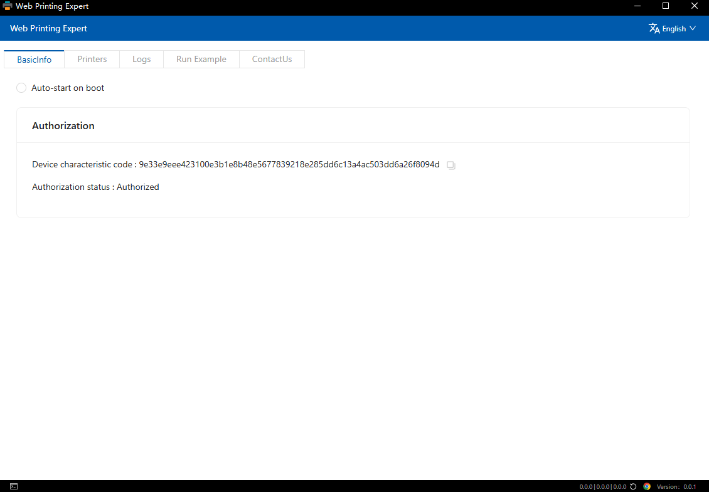
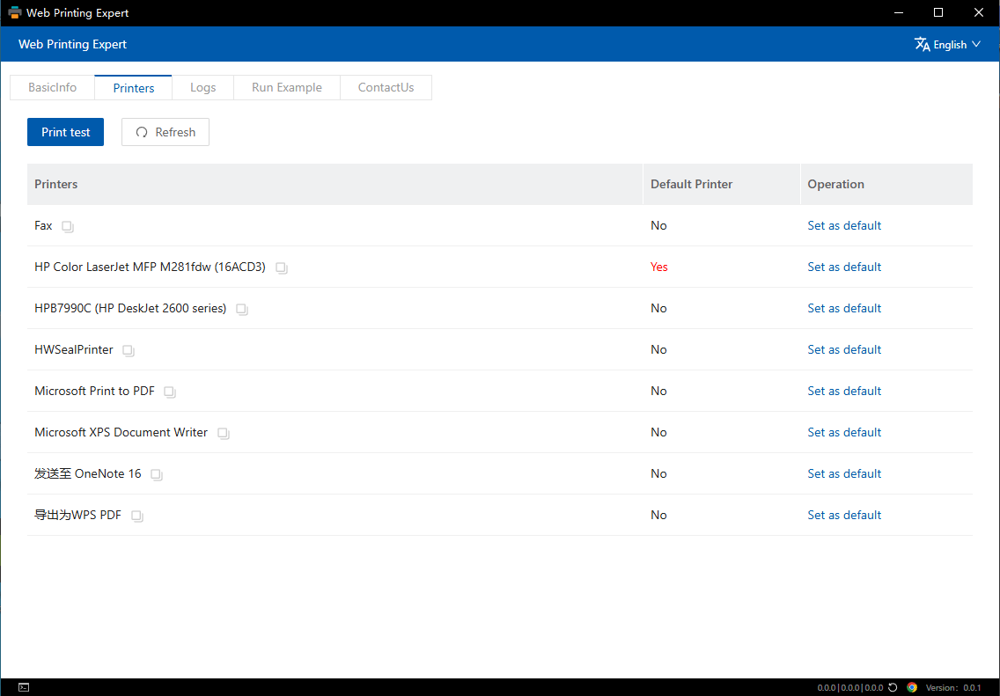
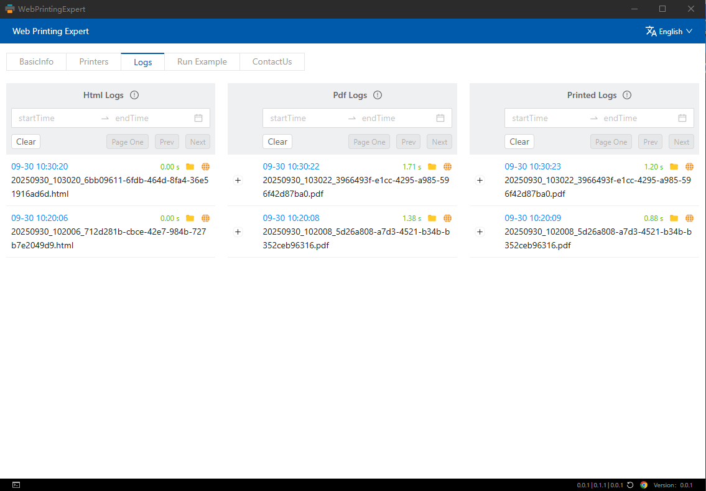
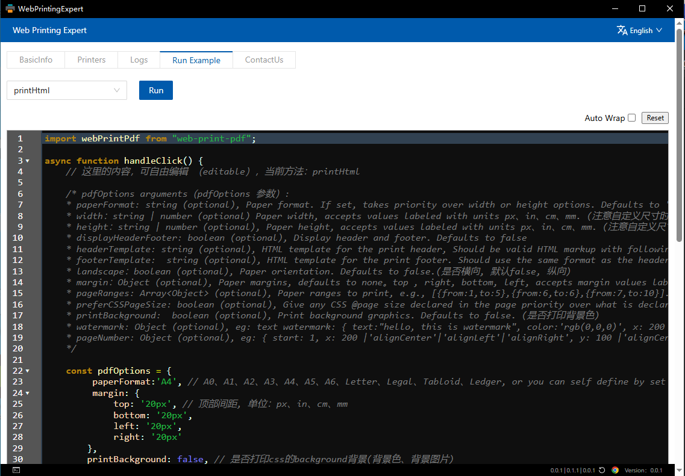
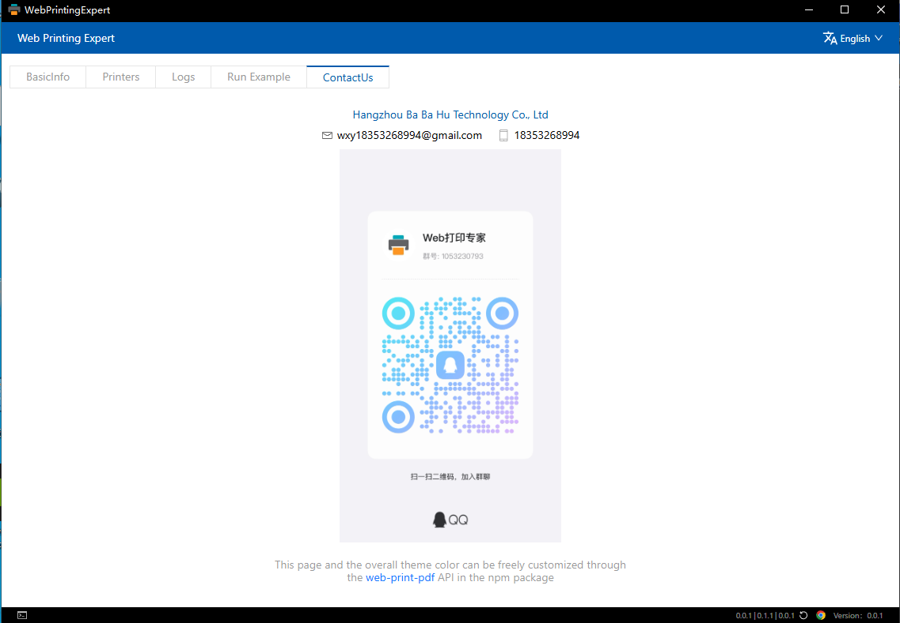

# WebPrintingExpert - Professional Web Printing Solution

<div align="center">

**Professional JavaScript Page Printing Solution | 专业的 JavaScript 页面打印解决方案**

HTML to PDF | Printer Management | WebSocket Printing | Node.js/Vue/React Printing

[English](README.MD) | [简体中文](README_CN.MD)

</div>

---

> **Keywords**: web printing, pdf printing, html to pdf, silent printing, printer management, print automation, remote printing, websocket printing, batch printing, print queue, printer control, document printing, print server, network printing, pdf generator, printing service, web to pdf, playwright, sumatrapdf, playwright pdf, electron printing

[](https://opensource.org/licenses/Apache-2.0)
[](https://www.microsoft.com/windows)
[](http://webprintpdf.com)
[](https://nodejs.org/)
[](https://electronjs.org/)
[](https://vuejs.org/)

## 📖 Introduction

WebPrintingExpert is a Windows desktop application built with Electron and Vue.js, specifically designed to solve web page printing challenges. The software provides powerful web printing services through WebSocket connections, supporting multiple document formats including HTML, PDF, and images. It integrates the Playwright HTML rendering engine and SumatraPDF printing tool to deliver intelligent printing solutions with bilingual support (English and Chinese).

> ⚠️ **Note**: This software only supports Windows 10 and above

**Official Website:** [http://webprintpdf.com](http://webprintpdf.com)

**Download:**
- Official Site: [http://webprintpdf.com/downloadApp/](http://webprintpdf.com/downloadApp/)
- GitHub Releases: [https://github.com/weixiaoyi/PrintWeb/releases](https://github.com/weixiaoyi/PrintWeb/releases)

## 🖼️ Software Interface

### Basic Information

*Main interface showing basic information and system status*

### Printer Management

*Printer configuration and management interface with multiple printer settings support*

### Print Logs

*Detailed print operation logs for tracking and debugging*

### Running Examples

*Software running examples and feature demonstrations*

### Contact Us

*Contact information and help interface*

## ✨ Key Features

- 🖨️ **Web Page Printing** - High-quality printing for various web pages
- 📄 **PDF Document Processing** - View, print, and convert PDF documents
- 🖼️ **Image Printing** - Support for multiple image format printing
- 🔧 **Printer Management** - Smart recognition and management of system printers
- 📊 **Print Logging** - Detailed print operation records and statistics
- 🌐 **WebSocket Service** - Stable WebSocket connection service
- 🎨 **Modern UI** - Modern user interface based on Vue.js 3
- ⚡ **High Performance** - Native desktop application performance with Electron
- 🌍 **Multilingual Support** - English and Chinese interface support
- 🎭 **HTML Rendering Engine** - Playwright-based HTML rendering and PDF output engine
- 📖 **PDF Print Output** - Integrated SumatraPDF for PDF file printing

## 🚀 Quick Start

### Option 1: Direct Download (Recommended)

Download the Windows desktop client with full feature support:

- **Download URL**: 
  - Official Site: [http://webprintpdf.com/downloadApp/](http://webprintpdf.com/downloadApp/)
  - GitHub Releases: [https://github.com/weixiaoyi/PrintWeb/releases](https://github.com/weixiaoyi/PrintWeb/releases)
- **File Size**: ~100MB
- **Requirements**: Windows 10 or above, at least 4GB RAM
- **Installation**: Download the exe file and run the installer directly

### Option 2: Development Setup

For building from source or contributing to development:

#### Requirements
- Node.js 16.0 or higher
- npm or yarn package manager
- **Windows 10 or above** (Windows only)

#### Install Dependencies

```bash
# Install Vue app dependencies
npm run install-vue

# Install Electron app dependencies
npm run install-electron
```

#### Development Mode

```bash
# Start development environment (Vue frontend + Electron app)
npm run start

# Or start separately
npm run start-vue      # Start Vue dev server
npm run start-electron # Start Electron app
```

#### Build for Production

```bash
# Build production version
npm run package
```

## 📦 Project Structure

```
PrintWeb/
├── electronApp/          # Electron main process code
│   ├── server/           # WebSocket server
│   ├── pdf/             # PDF processing module
│   └── assets/          # Application resources
├── vueApp/              # Vue.js frontend application
│   ├── src/             # Source code
│   ├── public/          # Static assets
│   └── dist/            # Build output
├── core/                # Core functionality modules
│   ├── base/            # Base utility classes
│   ├── electron/        # Electron-related features
│   ├── generateHtml/    # HTML generator
│   ├── generatePdf/     # PDF generator
│   └── printPdf/        # PDF printing module
├── appAsarUnpack/       # Unpacked app files
└── dist/                # Final build output
```

## 🔧 Technology Stack

### Frontend
- **Vue.js 3.5.8** - Progressive JavaScript framework
- **Ant Design Vue 4.2.6** - Enterprise-level UI component library
- **Vite 5.3.1** - Fast frontend build tool

### Backend
- **Electron 36.3.1** - Cross-platform desktop application framework
- **Express 4.18.2** - Web application framework
- **WebSocket** - Real-time communication protocol
- **PDF-lib 1.17.1** - PDF document processing library
- **Playwright 1.54.2** - HTML rendering and PDF output page engine
- **SumatraPDF** - PDF file printing output tool

### Development Tools
- **ESLint** - Code quality checker
- **Prettier** - Code formatter
- **Electron Builder** - Application packaging tool

## 📋 Usage Guide

1. **Launch Application** - Run `npm run start` to start the application
2. **Connect Service** - Application will automatically start WebSocket service
3. **Select Printer** - Choose the printer to use in settings
4. **Send Print Jobs** - Send print jobs via WebSocket or API
5. **View Logs** - Check print operation records in the logs page

## 🔌 API Interface

### WebSocket Connection
- **Connection URL**: `ws://localhost:port`
- **Protocol**: Custom printing protocol support

### HTTP API
- **Base URL**: `http://localhost:port/api`
- **Documentation**: See API documentation

## 🤝 Contributing

We welcome all forms of contributions, including but not limited to:

- 🐛 Bug reports
- ✨ Feature requests
- 📝 Documentation improvements
- 🔧 Code fixes

## 📄 License

This project is licensed under the Apache License 2.0 - see the [LICENSE](LICENSE) file for details.

## 🔗 Related Links

- **Official Website**: [http://webprintpdf.com](http://webprintpdf.com)
- **Download**: 
  - Official Site: [http://webprintpdf.com/downloadApp/](http://webprintpdf.com/downloadApp/)
  - GitHub Releases: [https://github.com/weixiaoyi/PrintWeb/releases](https://github.com/weixiaoyi/PrintWeb/releases)
- **Client Library**: [web-print-pdf](https://github.com/weixiaoyi/web-print-pdf)
- **Issue Tracker**: [GitHub Issues](https://github.com/weixiaoyi/PrintWeb/issues)

## 📞 Contact Us

- **Company**: Hangzhou BaBaHu Technology Co., Ltd.
- **Website**: [http://webprintpdf.com](http://webprintpdf.com)
- **Email**: Contact us through the official website

---

⭐ If this project helps you, please give us a Star!

---

## 🏷️ GitHub Topics Recommendations

Add the following topics to your GitHub repository settings to improve search visibility:

`web-printing` `pdf-printing` `html-to-pdf` `printing-service` `silent-printing` `printer-management` `print-automation` `remote-printing` `websocket-printing` `batch-printing` `print-queue` `printer-control` `document-printing` `web-to-pdf` `pdf-generator` `print-server` `playwright` `sumatrapdf` `playwright-pdf` `electron-printing` `electron` `vue`
